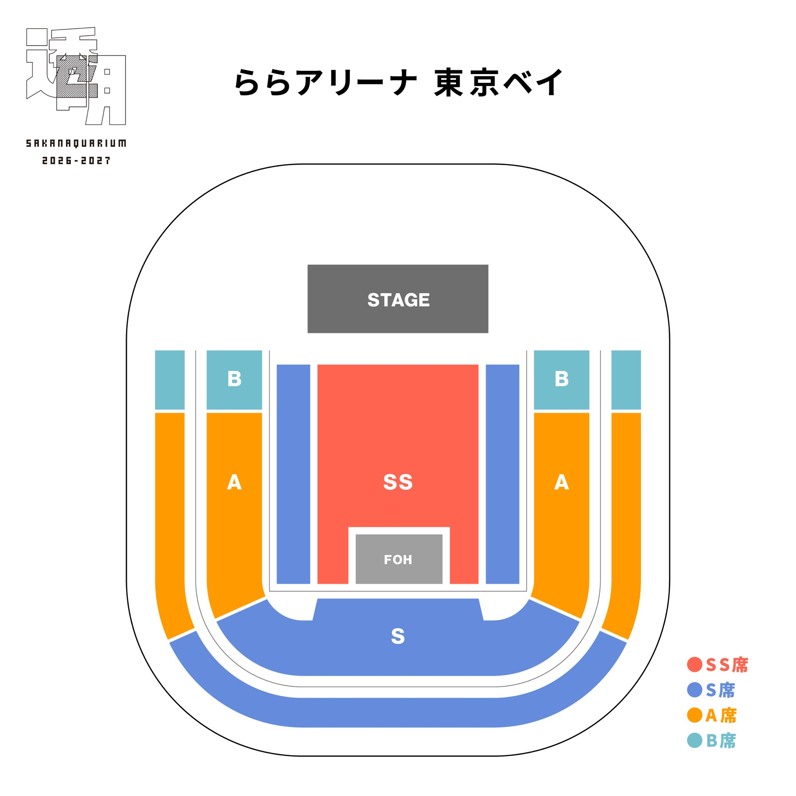
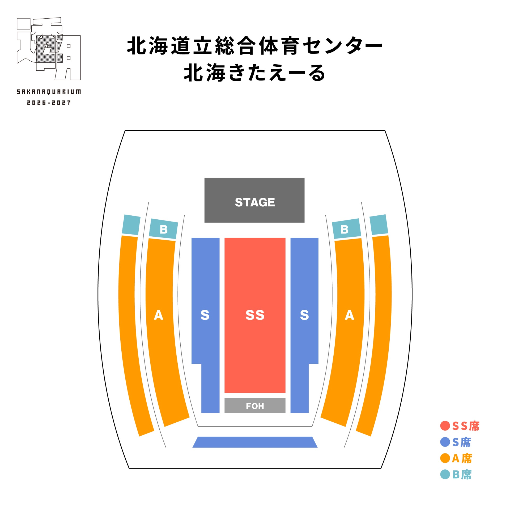
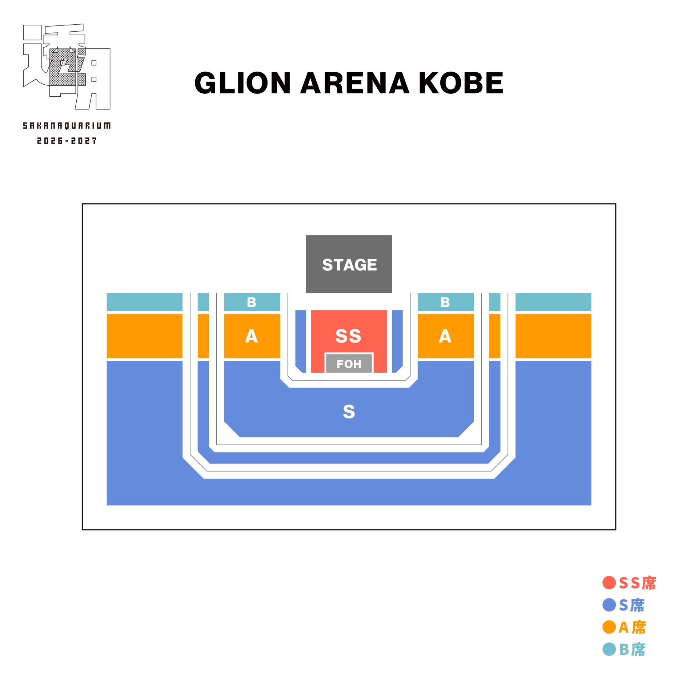
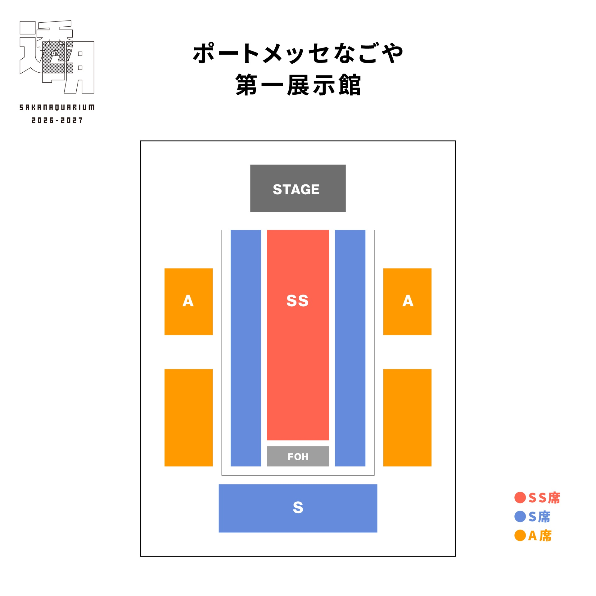
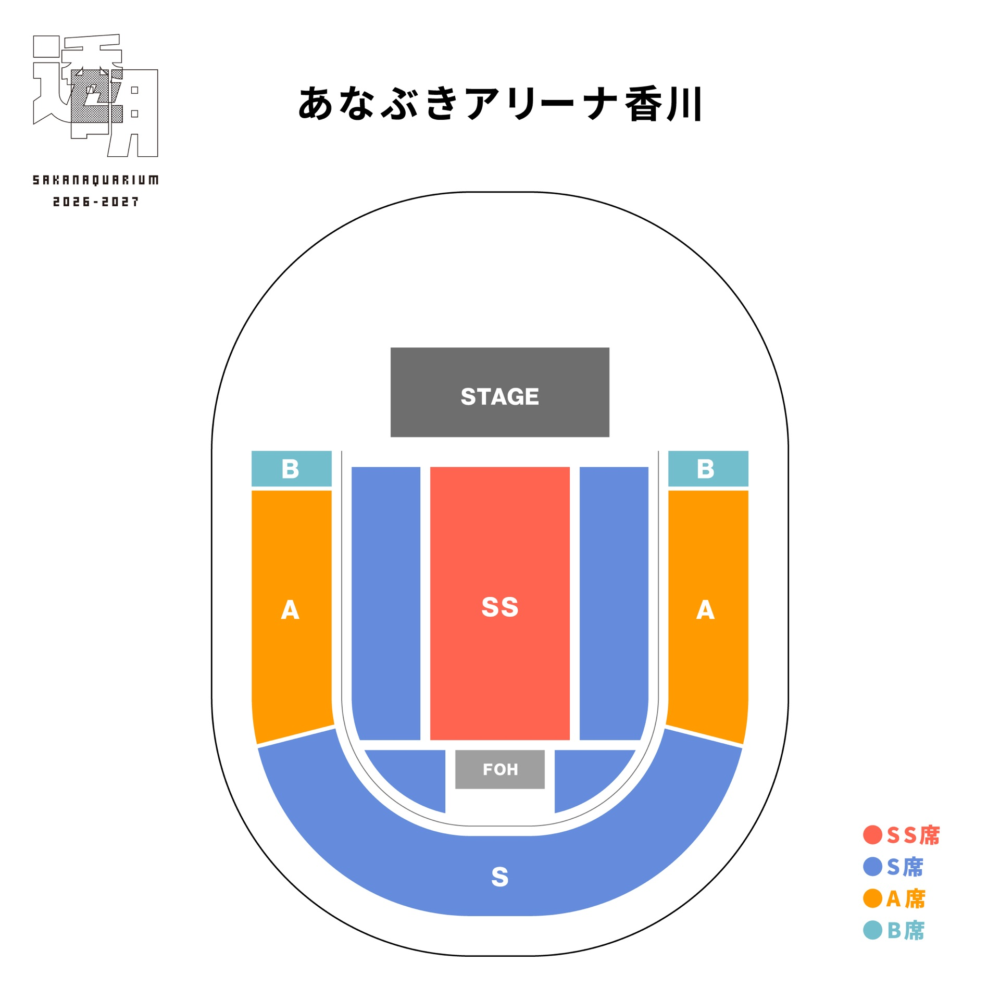
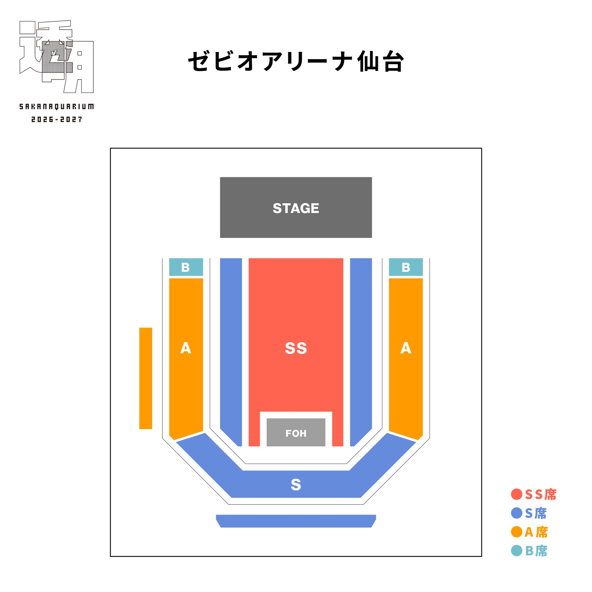
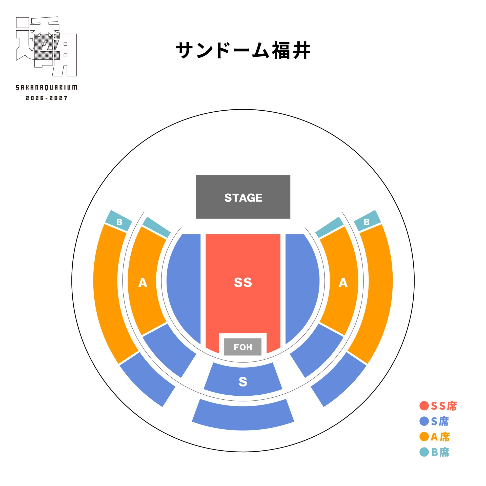
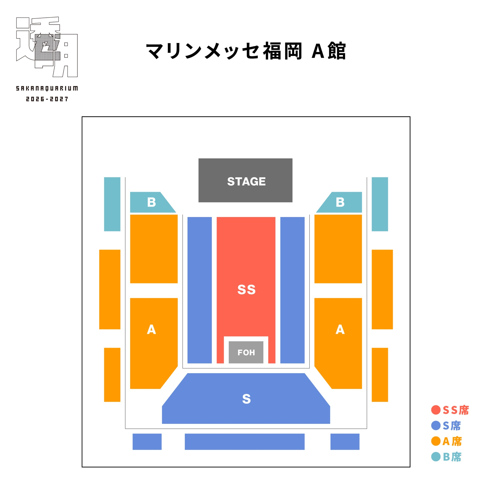
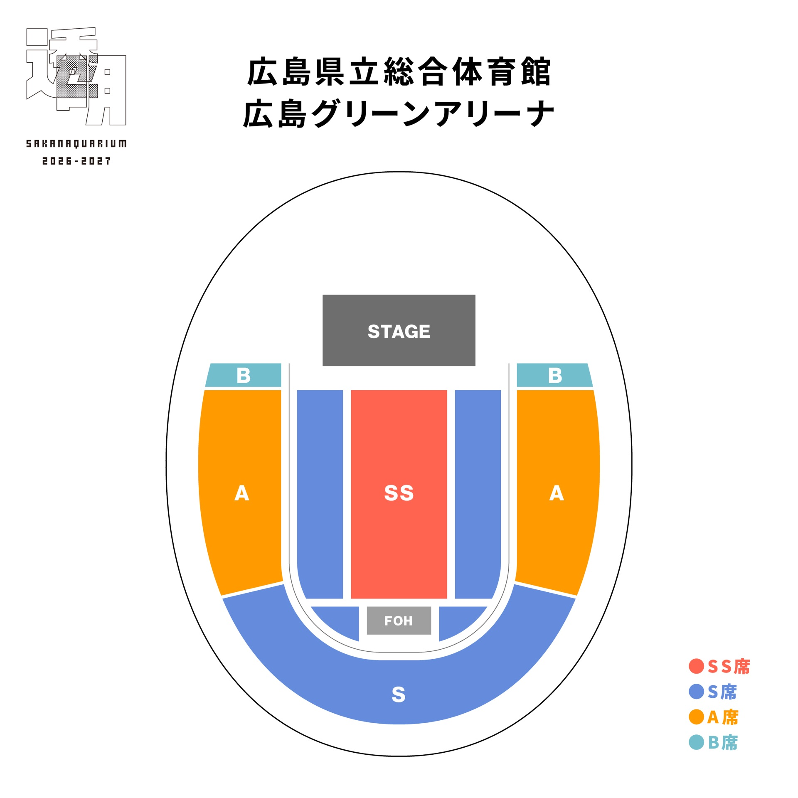

# 2027透明｜場內視角 YouTube 搜尋

SAKANAQUARIUM 2026-2027「透明」巡演場館的**場內視角（POV）**參考搜尋頁。
點擊連結後，在 YouTube 結果中挑選標明座位區域的粉絲／觀眾影片。

## 使用方式

1. 點擊各場館下方對應票種或樓層的搜尋連結。
2. 篩選標題含「見え方」「視野」「POV」「席から」等關鍵字的影片。
3. 依頁尾**檢查清單**核對後再收錄為參考資料。

## 可信度聲明

- YouTube 粉絲／觀眾影片僅屬**概略可用**：適合了解距離感、高度與大致視野。
- **不可**替代官方座席表、售票配置或 technical rider（見 [`venues_Dataset.md`](https://github.com/stin9k/Sakanaction2027Tour_VenueInfo/blob/main/venues_Dataset.md)）。
- 2027 本巡演多數場次尚未舉行；搜尋結果多為同場館**其他演唱會**，舞台配置可能不同。
- SS／S／A／B 為票種標籤，各巡演分區未必一致，標題標記也常有誤差。

## 目錄（巡演順序）

- [1. ららアリーナ 東京ベイ（LaLa arena 東京灣）](#1-ららアリーナ-東京ベイ)
- [2. 北海きたえーる（北海 Kitayell）](#2-北海きたえーる)
- [3. GLION ARENA KOBE（GLION ARENA 神戶）](#3-glion-arena-kobe)
- [4. ポートメッセなごや 第一展示館（Port Messe 名古屋 第一展示館）](#4-ポートメッセなごや-第一展示館)
- [5. あなぶきアリーナ香川（穴吹アリーナ香川）](#5-あなぶきアリーナ香川)
- [6. ゼビオアリーナ仙台（Xebio Arena 仙台）](#6-ゼビオアリーナ仙台)
- [7. サンドーム福井（Sun Dome 福井）](#7-サンドーム福井)
- [8. マリンメッセ福岡 A館（Marine Messe 福岡 A館）](#8-マリンメッセ福岡-a館)
- [9. 広島グリーンアリーナ（廣島格林アリーナ）](#9-広島グリーンアリーナ)

---

## 1. ららアリーナ 東京ベイ

**LaLa arena 東京灣**

**原始座席圖**（[`seatmap_lala.jpg`](original/seatmap_lala.jpg)）

### YouTube 搜尋連結

| 類型 | 關鍵字 | 連結 |
|---|---|---|
| 全館概覽 | `ららアリーナ 東京ベイ ライブ 客席 視野` | [YouTube 搜尋](https://www.youtube.com/results?search_query=%E3%82%89%E3%82%89%E3%82%A2%E3%83%AA%E3%83%BC%E3%83%8A+%E6%9D%B1%E4%BA%AC%E3%83%99%E3%82%A4+%E3%83%A9%E3%82%A4%E3%83%96+%E5%AE%A2%E5%B8%AD+%E8%A6%96%E9%87%8E) |
| SS席 | `ららアリーナ 東京ベイ SS席 見え方` | [YouTube 搜尋](https://www.youtube.com/results?search_query=%E3%82%89%E3%82%89%E3%82%A2%E3%83%AA%E3%83%BC%E3%83%8A+%E6%9D%B1%E4%BA%AC%E3%83%99%E3%82%A4+SS%E5%B8%AD+%E8%A6%8B%E3%81%88%E6%96%B9) |
| S席 | `ららアリーナ 東京ベイ S席 見え方` | [YouTube 搜尋](https://www.youtube.com/results?search_query=%E3%82%89%E3%82%89%E3%82%A2%E3%83%AA%E3%83%BC%E3%83%8A+%E6%9D%B1%E4%BA%AC%E3%83%99%E3%82%A4+S%E5%B8%AD+%E8%A6%8B%E3%81%88%E6%96%B9) |
| A席 | `ららアリーナ 東京ベイ A席 見え方` | [YouTube 搜尋](https://www.youtube.com/results?search_query=%E3%82%89%E3%82%89%E3%82%A2%E3%83%AA%E3%83%BC%E3%83%8A+%E6%9D%B1%E4%BA%AC%E3%83%99%E3%82%A4+A%E5%B8%AD+%E8%A6%8B%E3%81%88%E6%96%B9) |
| B席 | `ららアリーナ 東京ベイ B席 見え方` | [YouTube 搜尋](https://www.youtube.com/results?search_query=%E3%82%89%E3%82%89%E3%82%A2%E3%83%AA%E3%83%BC%E3%83%8A+%E6%9D%B1%E4%BA%AC%E3%83%99%E3%82%A4+B%E5%B8%AD+%E8%A6%8B%E3%81%88%E6%96%B9) |
| 1F 地板席 | `ららアリーナ 東京ベイ アリーナ席 視野 POV` | [YouTube 搜尋](https://www.youtube.com/results?search_query=%E3%82%89%E3%82%89%E3%82%A2%E3%83%AA%E3%83%BC%E3%83%8A+%E6%9D%B1%E4%BA%AC%E3%83%99%E3%82%A4+%E3%82%A2%E3%83%AA%E3%83%BC%E3%83%8A%E5%B8%AD+%E8%A6%96%E9%87%8E+POV) |
| 看台 | `ららアリーナ 東京ベイ スタンド 見え方` | [YouTube 搜尋](https://www.youtube.com/results?search_query=%E3%82%89%E3%82%89%E3%82%A2%E3%83%AA%E3%83%BC%E3%83%8A+%E6%9D%B1%E4%BA%AC%E3%83%99%E3%82%A4+%E3%82%B9%E3%82%BF%E3%83%B3%E3%83%89+%E8%A6%8B%E3%81%88%E6%96%B9) |

## 2. 北海きたえーる

**北海 Kitayell**

**原始座席圖**（[`seatmap_kitaeru.jpg`](original/seatmap_kitaeru.jpg)）

### YouTube 搜尋連結

| 類型 | 關鍵字 | 連結 |
|---|---|---|
| 全館概覽 | `北海きたえーる ライブ 客席 視野` | [YouTube 搜尋](https://www.youtube.com/results?search_query=%E5%8C%97%E6%B5%B7%E3%81%8D%E3%81%9F%E3%81%88%E3%83%BC%E3%82%8B+%E3%83%A9%E3%82%A4%E3%83%96+%E5%AE%A2%E5%B8%AD+%E8%A6%96%E9%87%8E) |
| 別名搜尋 | `北海道立総合体育センター ライブ 視野` | [YouTube 搜尋](https://www.youtube.com/results?search_query=%E5%8C%97%E6%B5%B7%E9%81%93%E7%AB%8B%E7%B7%8F%E5%90%88%E4%BD%93%E8%82%B2%E3%82%BB%E3%83%B3%E3%82%BF%E3%83%BC+%E3%83%A9%E3%82%A4%E3%83%96+%E8%A6%96%E9%87%8E) |
| SS席 | `北海きたえーる SS席 見え方` | [YouTube 搜尋](https://www.youtube.com/results?search_query=%E5%8C%97%E6%B5%B7%E3%81%8D%E3%81%9F%E3%81%88%E3%83%BC%E3%82%8B+SS%E5%B8%AD+%E8%A6%8B%E3%81%88%E6%96%B9) |
| S席 | `北海きたえーる S席 見え方` | [YouTube 搜尋](https://www.youtube.com/results?search_query=%E5%8C%97%E6%B5%B7%E3%81%8D%E3%81%9F%E3%81%88%E3%83%BC%E3%82%8B+S%E5%B8%AD+%E8%A6%8B%E3%81%88%E6%96%B9) |
| A席 | `北海きたえーる A席 見え方` | [YouTube 搜尋](https://www.youtube.com/results?search_query=%E5%8C%97%E6%B5%B7%E3%81%8D%E3%81%9F%E3%81%88%E3%83%BC%E3%82%8B+A%E5%B8%AD+%E8%A6%8B%E3%81%88%E6%96%B9) |
| B席 | `北海きたえーる B席 見え方` | [YouTube 搜尋](https://www.youtube.com/results?search_query=%E5%8C%97%E6%B5%B7%E3%81%8D%E3%81%9F%E3%81%88%E3%83%BC%E3%82%8B+B%E5%B8%AD+%E8%A6%8B%E3%81%88%E6%96%B9) |
| 1F 地板席 | `北海きたえーる アリーナ席 視野 POV` | [YouTube 搜尋](https://www.youtube.com/results?search_query=%E5%8C%97%E6%B5%B7%E3%81%8D%E3%81%9F%E3%81%88%E3%83%BC%E3%82%8B+%E3%82%A2%E3%83%AA%E3%83%BC%E3%83%8A%E5%B8%AD+%E8%A6%96%E9%87%8E+POV) |
| 看台 | `北海きたえーる スタンド 見え方` | [YouTube 搜尋](https://www.youtube.com/results?search_query=%E5%8C%97%E6%B5%B7%E3%81%8D%E3%81%9F%E3%81%88%E3%83%BC%E3%82%8B+%E3%82%B9%E3%82%BF%E3%83%B3%E3%83%89+%E8%A6%8B%E3%81%88%E6%96%B9) |

## 3. GLION ARENA KOBE

**GLION ARENA 神戶**

**原始座席圖**（[`seatmap_kobe.jpg`](original/seatmap_kobe.jpg)）

### YouTube 搜尋連結

| 類型 | 關鍵字 | 連結 |
|---|---|---|
| 全館概覽 | `GLION ARENA KOBE ライブ 客席 視野` | [YouTube 搜尋](https://www.youtube.com/results?search_query=GLION+ARENA+KOBE+%E3%83%A9%E3%82%A4%E3%83%96+%E5%AE%A2%E5%B8%AD+%E8%A6%96%E9%87%8E) |
| 別名搜尋 | `神戸ワールド記念ホール ライブ 視野` | [YouTube 搜尋](https://www.youtube.com/results?search_query=%E7%A5%9E%E6%88%B8%E3%83%AF%E3%83%BC%E3%83%AB%E3%83%89%E8%A8%98%E5%BF%B5%E3%83%9B%E3%83%BC%E3%83%AB+%E3%83%A9%E3%82%A4%E3%83%96+%E8%A6%96%E9%87%8E) |
| SS席 | `GLION ARENA KOBE SS席 見え方` | [YouTube 搜尋](https://www.youtube.com/results?search_query=GLION+ARENA+KOBE+SS%E5%B8%AD+%E8%A6%8B%E3%81%88%E6%96%B9) |
| S席 | `GLION ARENA KOBE S席 見え方` | [YouTube 搜尋](https://www.youtube.com/results?search_query=GLION+ARENA+KOBE+S%E5%B8%AD+%E8%A6%8B%E3%81%88%E6%96%B9) |
| A席 | `GLION ARENA KOBE A席 見え方` | [YouTube 搜尋](https://www.youtube.com/results?search_query=GLION+ARENA+KOBE+A%E5%B8%AD+%E8%A6%8B%E3%81%88%E6%96%B9) |
| B席 | `GLION ARENA KOBE B席 見え方` | [YouTube 搜尋](https://www.youtube.com/results?search_query=GLION+ARENA+KOBE+B%E5%B8%AD+%E8%A6%8B%E3%81%88%E6%96%B9) |
| 1F 地板席 | `GLION ARENA KOBE アリーナ席 視野 POV` | [YouTube 搜尋](https://www.youtube.com/results?search_query=GLION+ARENA+KOBE+%E3%82%A2%E3%83%AA%E3%83%BC%E3%83%8A%E5%B8%AD+%E8%A6%96%E9%87%8E+POV) |
| 看台 | `GLION ARENA KOBE スタンド 見え方` | [YouTube 搜尋](https://www.youtube.com/results?search_query=GLION+ARENA+KOBE+%E3%82%B9%E3%82%BF%E3%83%B3%E3%83%89+%E8%A6%8B%E3%81%88%E6%96%B9) |

## 4. ポートメッセなごや 第一展示館

**Port Messe 名古屋 第一展示館**

**原始座席圖**（[`seatmap_portmesse.jpg`](original/seatmap_portmesse.jpg)）

### YouTube 搜尋連結

| 類型 | 關鍵字 | 連結 |
|---|---|---|
| 全館概覽 | `ポートメッセなごや 第一展示館 ライブ 客席 視野` | [YouTube 搜尋](https://www.youtube.com/results?search_query=%E3%83%9D%E3%83%BC%E3%83%88%E3%83%A1%E3%83%83%E3%82%BB%E3%81%AA%E3%81%94%E3%82%84+%E7%AC%AC%E4%B8%80%E5%B1%95%E7%A4%BA%E9%A4%A8+%E3%83%A9%E3%82%A4%E3%83%96+%E5%AE%A2%E5%B8%AD+%E8%A6%96%E9%87%8E) |
| SS席 | `ポートメッセなごや 第一展示館 SS席 見え方` | [YouTube 搜尋](https://www.youtube.com/results?search_query=%E3%83%9D%E3%83%BC%E3%83%88%E3%83%A1%E3%83%83%E3%82%BB%E3%81%AA%E3%81%94%E3%82%84+%E7%AC%AC%E4%B8%80%E5%B1%95%E7%A4%BA%E9%A4%A8+SS%E5%B8%AD+%E8%A6%8B%E3%81%88%E6%96%B9) |
| S席 | `ポートメッセなごや 第一展示館 S席 見え方` | [YouTube 搜尋](https://www.youtube.com/results?search_query=%E3%83%9D%E3%83%BC%E3%83%88%E3%83%A1%E3%83%83%E3%82%BB%E3%81%AA%E3%81%94%E3%82%84+%E7%AC%AC%E4%B8%80%E5%B1%95%E7%A4%BA%E9%A4%A8+S%E5%B8%AD+%E8%A6%8B%E3%81%88%E6%96%B9) |
| A席 | `ポートメッセなごや 第一展示館 A席 見え方` | [YouTube 搜尋](https://www.youtube.com/results?search_query=%E3%83%9D%E3%83%BC%E3%83%88%E3%83%A1%E3%83%83%E3%82%BB%E3%81%AA%E3%81%94%E3%82%84+%E7%AC%AC%E4%B8%80%E5%B1%95%E7%A4%BA%E9%A4%A8+A%E5%B8%AD+%E8%A6%8B%E3%81%88%E6%96%B9) |
| 前方／後方 | `ポートメッセなごや 第一展示館 前方 後方 見え方` | [YouTube 搜尋](https://www.youtube.com/results?search_query=%E3%83%9D%E3%83%BC%E3%83%88%E3%83%A1%E3%83%83%E3%82%BB%E3%81%AA%E3%81%94%E3%82%84+%E7%AC%AC%E4%B8%80%E5%B1%95%E7%A4%BA%E9%A4%A8+%E5%89%8D%E6%96%B9+%E5%BE%8C%E6%96%B9+%E8%A6%8B%E3%81%88%E6%96%B9) |

> 此場為單層平面配置（無常設高架看台）；票種僅 SS／S／A。

## 5. あなぶきアリーナ香川

**穴吹アリーナ香川**

**原始座席圖**（[`seatmap_anabuki.jpg`](original/seatmap_anabuki.jpg)）

### YouTube 搜尋連結

| 類型 | 關鍵字 | 連結 |
|---|---|---|
| 全館概覽 | `あなぶきアリーナ香川 ライブ 客席 視野` | [YouTube 搜尋](https://www.youtube.com/results?search_query=%E3%81%82%E3%81%AA%E3%81%B6%E3%81%8D%E3%82%A2%E3%83%AA%E3%83%BC%E3%83%8A%E9%A6%99%E5%B7%9D+%E3%83%A9%E3%82%A4%E3%83%96+%E5%AE%A2%E5%B8%AD+%E8%A6%96%E9%87%8E) |
| SS席 | `あなぶきアリーナ香川 SS席 見え方` | [YouTube 搜尋](https://www.youtube.com/results?search_query=%E3%81%82%E3%81%AA%E3%81%B6%E3%81%8D%E3%82%A2%E3%83%AA%E3%83%BC%E3%83%8A%E9%A6%99%E5%B7%9D+SS%E5%B8%AD+%E8%A6%8B%E3%81%88%E6%96%B9) |
| S席 | `あなぶきアリーナ香川 S席 見え方` | [YouTube 搜尋](https://www.youtube.com/results?search_query=%E3%81%82%E3%81%AA%E3%81%B6%E3%81%8D%E3%82%A2%E3%83%AA%E3%83%BC%E3%83%8A%E9%A6%99%E5%B7%9D+S%E5%B8%AD+%E8%A6%8B%E3%81%88%E6%96%B9) |
| A席 | `あなぶきアリーナ香川 A席 見え方` | [YouTube 搜尋](https://www.youtube.com/results?search_query=%E3%81%82%E3%81%AA%E3%81%B6%E3%81%8D%E3%82%A2%E3%83%AA%E3%83%BC%E3%83%8A%E9%A6%99%E5%B7%9D+A%E5%B8%AD+%E8%A6%8B%E3%81%88%E6%96%B9) |
| B席 | `あなぶきアリーナ香川 B席 見え方` | [YouTube 搜尋](https://www.youtube.com/results?search_query=%E3%81%82%E3%81%AA%E3%81%B6%E3%81%8D%E3%82%A2%E3%83%AA%E3%83%BC%E3%83%8A%E9%A6%99%E5%B7%9D+B%E5%B8%AD+%E8%A6%8B%E3%81%88%E6%96%B9) |
| 1F 地板席 | `あなぶきアリーナ香川 アリーナ席 視野 POV` | [YouTube 搜尋](https://www.youtube.com/results?search_query=%E3%81%82%E3%81%AA%E3%81%B6%E3%81%8D%E3%82%A2%E3%83%AA%E3%83%BC%E3%83%8A%E9%A6%99%E5%B7%9D+%E3%82%A2%E3%83%AA%E3%83%BC%E3%83%8A%E5%B8%AD+%E8%A6%96%E9%87%8E+POV) |
| 看台 | `あなぶきアリーナ香川 スタンド 見え方` | [YouTube 搜尋](https://www.youtube.com/results?search_query=%E3%81%82%E3%81%AA%E3%81%B6%E3%81%8D%E3%82%A2%E3%83%AA%E3%83%BC%E3%83%8A%E9%A6%99%E5%B7%9D+%E3%82%B9%E3%82%BF%E3%83%B3%E3%83%89+%E8%A6%8B%E3%81%88%E6%96%B9) |

## 6. ゼビオアリーナ仙台

**Xebio Arena 仙台**

**原始座席圖**（[`seatmap_zevioarena.jpg`](original/seatmap_zevioarena.jpg)）

### YouTube 搜尋連結

| 類型 | 關鍵字 | 連結 |
|---|---|---|
| 全館概覽 | `ゼビオアリーナ仙台 ライブ 客席 視野` | [YouTube 搜尋](https://www.youtube.com/results?search_query=%E3%82%BC%E3%83%93%E3%82%AA%E3%82%A2%E3%83%AA%E3%83%BC%E3%83%8A%E4%BB%99%E5%8F%B0+%E3%83%A9%E3%82%A4%E3%83%96+%E5%AE%A2%E5%B8%AD+%E8%A6%96%E9%87%8E) |
| SS席 | `ゼビオアリーナ仙台 SS席 見え方` | [YouTube 搜尋](https://www.youtube.com/results?search_query=%E3%82%BC%E3%83%93%E3%82%AA%E3%82%A2%E3%83%AA%E3%83%BC%E3%83%8A%E4%BB%99%E5%8F%B0+SS%E5%B8%AD+%E8%A6%8B%E3%81%88%E6%96%B9) |
| S席 | `ゼビオアリーナ仙台 S席 見え方` | [YouTube 搜尋](https://www.youtube.com/results?search_query=%E3%82%BC%E3%83%93%E3%82%AA%E3%82%A2%E3%83%AA%E3%83%BC%E3%83%8A%E4%BB%99%E5%8F%B0+S%E5%B8%AD+%E8%A6%8B%E3%81%88%E6%96%B9) |
| A席 | `ゼビオアリーナ仙台 A席 見え方` | [YouTube 搜尋](https://www.youtube.com/results?search_query=%E3%82%BC%E3%83%93%E3%82%AA%E3%82%A2%E3%83%AA%E3%83%BC%E3%83%8A%E4%BB%99%E5%8F%B0+A%E5%B8%AD+%E8%A6%8B%E3%81%88%E6%96%B9) |
| B席 | `ゼビオアリーナ仙台 B席 見え方` | [YouTube 搜尋](https://www.youtube.com/results?search_query=%E3%82%BC%E3%83%93%E3%82%AA%E3%82%A2%E3%83%AA%E3%83%BC%E3%83%8A%E4%BB%99%E5%8F%B0+B%E5%B8%AD+%E8%A6%8B%E3%81%88%E6%96%B9) |
| 1F 地板席 | `ゼビオアリーナ仙台 アリーナ席 視野 POV` | [YouTube 搜尋](https://www.youtube.com/results?search_query=%E3%82%BC%E3%83%93%E3%82%AA%E3%82%A2%E3%83%AA%E3%83%BC%E3%83%8A%E4%BB%99%E5%8F%B0+%E3%82%A2%E3%83%AA%E3%83%BC%E3%83%8A%E5%B8%AD+%E8%A6%96%E9%87%8E+POV) |
| 看台 | `ゼビオアリーナ仙台 スタンド 見え方` | [YouTube 搜尋](https://www.youtube.com/results?search_query=%E3%82%BC%E3%83%93%E3%82%AA%E3%82%A2%E3%83%AA%E3%83%BC%E3%83%8A%E4%BB%99%E5%8F%B0+%E3%82%B9%E3%82%BF%E3%83%B3%E3%83%89+%E8%A6%8B%E3%81%88%E6%96%B9) |

## 7. サンドーム福井

**Sun Dome 福井**

**原始座席圖**（[`seatmap_sundom.jpg`](original/seatmap_sundom.jpg)）

### YouTube 搜尋連結

| 類型 | 關鍵字 | 連結 |
|---|---|---|
| 全館概覽 | `サンドーム福井 ライブ 客席 視野` | [YouTube 搜尋](https://www.youtube.com/results?search_query=%E3%82%B5%E3%83%B3%E3%83%89%E3%83%BC%E3%83%A0%E7%A6%8F%E4%BA%95+%E3%83%A9%E3%82%A4%E3%83%96+%E5%AE%A2%E5%B8%AD+%E8%A6%96%E9%87%8E) |
| SS席 | `サンドーム福井 SS席 見え方` | [YouTube 搜尋](https://www.youtube.com/results?search_query=%E3%82%B5%E3%83%B3%E3%83%89%E3%83%BC%E3%83%A0%E7%A6%8F%E4%BA%95+SS%E5%B8%AD+%E8%A6%8B%E3%81%88%E6%96%B9) |
| S席 | `サンドーム福井 S席 見え方` | [YouTube 搜尋](https://www.youtube.com/results?search_query=%E3%82%B5%E3%83%B3%E3%83%89%E3%83%BC%E3%83%A0%E7%A6%8F%E4%BA%95+S%E5%B8%AD+%E8%A6%8B%E3%81%88%E6%96%B9) |
| A席 | `サンドーム福井 A席 見え方` | [YouTube 搜尋](https://www.youtube.com/results?search_query=%E3%82%B5%E3%83%B3%E3%83%89%E3%83%BC%E3%83%A0%E7%A6%8F%E4%BA%95+A%E5%B8%AD+%E8%A6%8B%E3%81%88%E6%96%B9) |
| B席 | `サンドーム福井 B席 見え方` | [YouTube 搜尋](https://www.youtube.com/results?search_query=%E3%82%B5%E3%83%B3%E3%83%89%E3%83%BC%E3%83%A0%E7%A6%8F%E4%BA%95+B%E5%B8%AD+%E8%A6%8B%E3%81%88%E6%96%B9) |
| 1F 地板席 | `サンドーム福井 アリーナ席 視野 POV` | [YouTube 搜尋](https://www.youtube.com/results?search_query=%E3%82%B5%E3%83%B3%E3%83%89%E3%83%BC%E3%83%A0%E7%A6%8F%E4%BA%95+%E3%82%A2%E3%83%AA%E3%83%BC%E3%83%8A%E5%B8%AD+%E8%A6%96%E9%87%8E+POV) |
| 看台 | `サンドーム福井 スタンド 見え方` | [YouTube 搜尋](https://www.youtube.com/results?search_query=%E3%82%B5%E3%83%B3%E3%83%89%E3%83%BC%E3%83%A0%E7%A6%8F%E4%BA%95+%E3%82%B9%E3%82%BF%E3%83%B3%E3%83%89+%E8%A6%8B%E3%81%88%E6%96%B9) |

## 8. マリンメッセ福岡 A館

**Marine Messe 福岡 A館**

**原始座席圖**（[`seatmap_marinmesse.jpg`](original/seatmap_marinmesse.jpg)）

### YouTube 搜尋連結

| 類型 | 關鍵字 | 連結 |
|---|---|---|
| 全館概覽 | `マリンメッセ福岡 A館 ライブ 客席 視野` | [YouTube 搜尋](https://www.youtube.com/results?search_query=%E3%83%9E%E3%83%AA%E3%83%B3%E3%83%A1%E3%83%83%E3%82%BB%E7%A6%8F%E5%B2%A1+A%E9%A4%A8+%E3%83%A9%E3%82%A4%E3%83%96+%E5%AE%A2%E5%B8%AD+%E8%A6%96%E9%87%8E) |
| SS席 | `マリンメッセ福岡 A館 SS席 見え方` | [YouTube 搜尋](https://www.youtube.com/results?search_query=%E3%83%9E%E3%83%AA%E3%83%B3%E3%83%A1%E3%83%83%E3%82%BB%E7%A6%8F%E5%B2%A1+A%E9%A4%A8+SS%E5%B8%AD+%E8%A6%8B%E3%81%88%E6%96%B9) |
| S席 | `マリンメッセ福岡 A館 S席 見え方` | [YouTube 搜尋](https://www.youtube.com/results?search_query=%E3%83%9E%E3%83%AA%E3%83%B3%E3%83%A1%E3%83%83%E3%82%BB%E7%A6%8F%E5%B2%A1+A%E9%A4%A8+S%E5%B8%AD+%E8%A6%8B%E3%81%88%E6%96%B9) |
| A席 | `マリンメッセ福岡 A館 A席 見え方` | [YouTube 搜尋](https://www.youtube.com/results?search_query=%E3%83%9E%E3%83%AA%E3%83%B3%E3%83%A1%E3%83%83%E3%82%BB%E7%A6%8F%E5%B2%A1+A%E9%A4%A8+A%E5%B8%AD+%E8%A6%8B%E3%81%88%E6%96%B9) |
| B席 | `マリンメッセ福岡 A館 B席 見え方` | [YouTube 搜尋](https://www.youtube.com/results?search_query=%E3%83%9E%E3%83%AA%E3%83%B3%E3%83%A1%E3%83%83%E3%82%BB%E7%A6%8F%E5%B2%A1+A%E9%A4%A8+B%E5%B8%AD+%E8%A6%8B%E3%81%88%E6%96%B9) |
| 1F 地板席 | `マリンメッセ福岡 A館 アリーナ席 視野 POV` | [YouTube 搜尋](https://www.youtube.com/results?search_query=%E3%83%9E%E3%83%AA%E3%83%B3%E3%83%A1%E3%83%83%E3%82%BB%E7%A6%8F%E5%B2%A1+A%E9%A4%A8+%E3%82%A2%E3%83%AA%E3%83%BC%E3%83%8A%E5%B8%AD+%E8%A6%96%E9%87%8E+POV) |
| 看台 | `マリンメッセ福岡 A館 スタンド 見え方` | [YouTube 搜尋](https://www.youtube.com/results?search_query=%E3%83%9E%E3%83%AA%E3%83%B3%E3%83%A1%E3%83%83%E3%82%BB%E7%A6%8F%E5%B2%A1+A%E9%A4%A8+%E3%82%B9%E3%82%BF%E3%83%B3%E3%83%89+%E8%A6%8B%E3%81%88%E6%96%B9) |

## 9. 広島グリーンアリーナ

**廣島格林アリーナ**

**原始座席圖**（[`seatmap_hiroshima.jpg`](original/seatmap_hiroshima.jpg)）

### YouTube 搜尋連結

| 類型 | 關鍵字 | 連結 |
|---|---|---|
| 全館概覽 | `広島グリーンアリーナ ライブ 客席 視野` | [YouTube 搜尋](https://www.youtube.com/results?search_query=%E5%BA%83%E5%B3%B6%E3%82%B0%E3%83%AA%E3%83%BC%E3%83%B3%E3%82%A2%E3%83%AA%E3%83%BC%E3%83%8A+%E3%83%A9%E3%82%A4%E3%83%96+%E5%AE%A2%E5%B8%AD+%E8%A6%96%E9%87%8E) |
| 別名搜尋 | `広島県立総合体育館 ライブ 視野` | [YouTube 搜尋](https://www.youtube.com/results?search_query=%E5%BA%83%E5%B3%B6%E7%9C%8C%E7%AB%8B%E7%B7%8F%E5%90%88%E4%BD%93%E8%82%B2%E9%A4%A8+%E3%83%A9%E3%82%A4%E3%83%96+%E8%A6%96%E9%87%8E) |
| SS席 | `広島グリーンアリーナ SS席 見え方` | [YouTube 搜尋](https://www.youtube.com/results?search_query=%E5%BA%83%E5%B3%B6%E3%82%B0%E3%83%AA%E3%83%BC%E3%83%B3%E3%82%A2%E3%83%AA%E3%83%BC%E3%83%8A+SS%E5%B8%AD+%E8%A6%8B%E3%81%88%E6%96%B9) |
| S席 | `広島グリーンアリーナ S席 見え方` | [YouTube 搜尋](https://www.youtube.com/results?search_query=%E5%BA%83%E5%B3%B6%E3%82%B0%E3%83%AA%E3%83%BC%E3%83%B3%E3%82%A2%E3%83%AA%E3%83%BC%E3%83%8A+S%E5%B8%AD+%E8%A6%8B%E3%81%88%E6%96%B9) |
| A席 | `広島グリーンアリーナ A席 見え方` | [YouTube 搜尋](https://www.youtube.com/results?search_query=%E5%BA%83%E5%B3%B6%E3%82%B0%E3%83%AA%E3%83%BC%E3%83%B3%E3%82%A2%E3%83%AA%E3%83%BC%E3%83%8A+A%E5%B8%AD+%E8%A6%8B%E3%81%88%E6%96%B9) |
| B席 | `広島グリーンアリーナ B席 見え方` | [YouTube 搜尋](https://www.youtube.com/results?search_query=%E5%BA%83%E5%B3%B6%E3%82%B0%E3%83%AA%E3%83%BC%E3%83%B3%E3%82%A2%E3%83%AA%E3%83%BC%E3%83%8A+B%E5%B8%AD+%E8%A6%8B%E3%81%88%E6%96%B9) |
| 1F 地板席 | `広島グリーンアリーナ アリーナ席 視野 POV` | [YouTube 搜尋](https://www.youtube.com/results?search_query=%E5%BA%83%E5%B3%B6%E3%82%B0%E3%83%AA%E3%83%BC%E3%83%B3%E3%82%A2%E3%83%AA%E3%83%BC%E3%83%8A+%E3%82%A2%E3%83%AA%E3%83%BC%E3%83%8A%E5%B8%AD+%E8%A6%96%E9%87%8E+POV) |
| 看台 | `広島グリーンアリーナ スタンド 見え方` | [YouTube 搜尋](https://www.youtube.com/results?search_query=%E5%BA%83%E5%B3%B6%E3%82%B0%E3%83%AA%E3%83%BC%E3%83%B3%E3%82%A2%E3%83%AA%E3%83%BC%E3%83%8A+%E3%82%B9%E3%82%BF%E3%83%B3%E3%83%89+%E8%A6%8B%E3%81%88%E6%96%B9) |

---

## 影片篩選檢查清單

收錄或引用某支影片前，請確認：

- [ ] 場館名稱正確（含 A館／第一展示館等）
- [ ] 票種區是否明確（SS／S／A／B）
- [ ] 樓層（1F アリーナ席 vs スタンド）
- [ ] 舞台配置（中央舞台／端舞台）
- [ ] 拍攝日期與藝人（與 2027 配置可能不同）
- [ ] 是否為相對固定的客席視角（非大量剪輯片段）

## 相關文件

- [場館資料分級](https://github.com/stin9k/Sakanaction2027Tour_VenueInfo/blob/main/venues_Dataset.md)（`venues_Dataset.md`）
- [補查清單](https://github.com/stin9k/Sakanaction2027Tour_VenueInfo/blob/main/venue_research_backlog.md)（`venue_research_backlog.md`）
- [查證報告](https://github.com/stin9k/Sakanaction2027Tour_VenueInfo/blob/main/sakanaction_2027_venue_factcheck.md)（`sakanaction_2027_venue_factcheck.md`）

---

*本頁由 `build_venue_youtube_search.py` 自動產生；修改場館資料後請重新執行腳本。*
